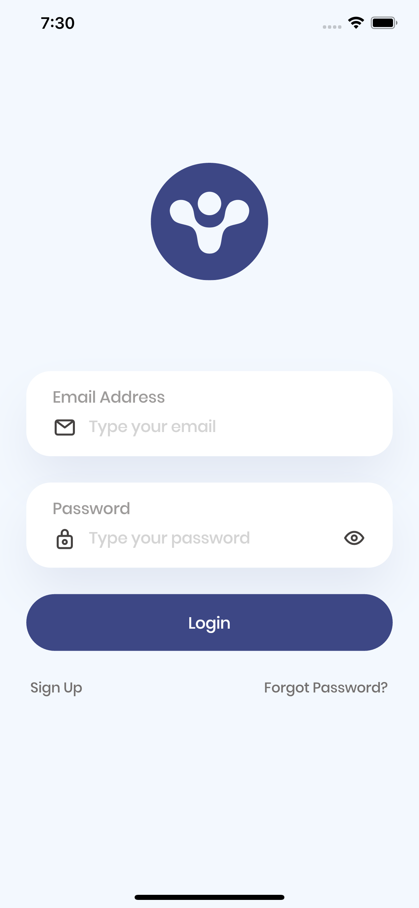
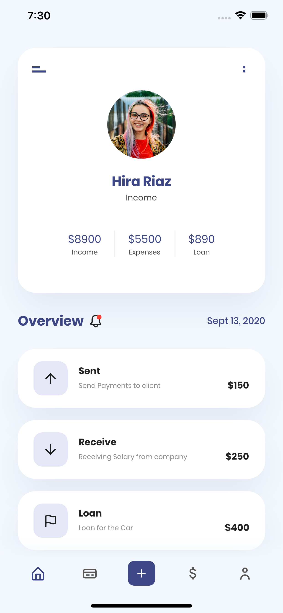
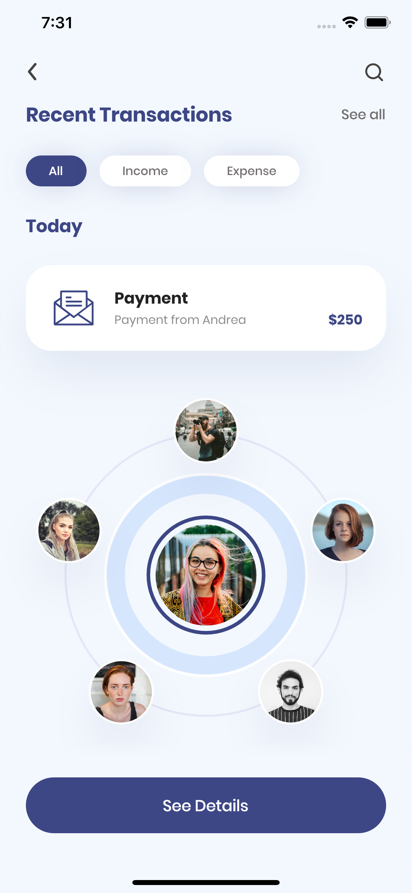

# Finance App

> A finance app that was built based on the layout: https://dribbble.com/shots/14210557-Finance-Mobile-Application-UX-UI-DesignLayout 


# 📲 Overview


    
    

**Obs**: The loading simulation uses a random Boolean value to show an example of error and success.

# 👨🏽‍💻 Installation


```
$ git clone https://github.com/gabrielvictorjs/dribble_finances_app.git

$ cd dribble_finances_app

# Install Flutter dependencies
$ flutter pub get

# Start compilation
$ flutter run

```
